# Теплопередача трансмісією

Сумарну теплопередачу [трансмісією](https://en.wikipedia.org/wiki/Thermal_transmittance) $Q_{tr}$, Вт·год, розраховують для кожного місяця за формулою:

$$Q_{tr}=H_{tr,adj}(θ_{int,set,H}-θ_e)t,\tag{1}$$

де $H_{tr,adj}$ — загальний коефіцієнт теплопередачі трансмісією зони, Вт/К, встановлений для різниці температур всередині-ззовні, визначений згідно з [розділом 3](transmission.md#3-узагальнені-коефіцієнти-теплопередачі-трансмісією);  
$θ_{int,set,H}$ — розрахункова (задана) внутрішня скоригована температура будівлі під час опалення, ℃, визначена згідно з [таблицею 1](transmission.md#1-значення-скоригованої-температури).  
$θ_e$ — середньомісячна температура зовнішнього середовища, ℃, визначена згідно з [додатком А](../appendixes/appendix-a.md);  
$t$ — тривалість місяця, для якого проводять розрахунок, год, визначена згідно з [таблицею 2](transmission.md#2-щомісячна-тривалість-часових-інтервалів).

## 1 Значення скоригованої температури

| Призначення будівлі                                     | Скоригована температура опалення, ℃ |
| :------------------------------------------------------ | :---------------------------------: |
| Одноквартирні будинки                                   |                 19                  |
| Багатоквартирні будинки, гуртожитки                     |                 19                  |
| Громадські будівлі адміністративного призначення, офіси |                 19                  |
| Будівлі закладів освіти                                 |                 19                  |
| Будівлі закладів дошкільної освіти                      |                 21                  |
| Будівлі закладів охорони здоров'я                       |                 21                  |
| Готелі                                                  |                 19                  |
| Ресторани                                               |                 19                  |
| Спортивні заклади                                       |                 17                  |
| Будівлі закладів гуртової та роздрібної торгівлі        |                 19                  |
| Будівлі культурно-розважальних установ                  |                 19                  |
| Інші види будівель                                      |                 19                  |

## 2 Щомісячна тривалість часових інтервалів

| Період   | Кількість діб | Кількість годин |
| :------- | :-----------: | :-------------: |
| Січень   |      31       |       744       |
| Лютий    |      28       |       672       |
| Березень |      31       |       744       |
| Квітень  |      30       |       720       |
| Травень  |      31       |       744       |
| Червень  |      30       |       720       |
| Липень   |      31       |       744       |
| Серпень  |      31       |       744       |
| Вересень |      30       |       720       |
| Жовтень  |      31       |       744       |
| Листопад |      30       |       720       |
| Грудень  |      31       |       744       |
| Рік      |      365      |      8760       |

## 3 Узагальнені коефіцієнти теплопередачі трансмісією

Сумарне значення узагальненого коефіцієнта теплопередачі трансмісією $H_{tr,adj}$, Bт/K, розраховують за формулою:

$$H_{tr,adj}=H_D+H_g+H_U,\tag{2}$$

де $H_D$ — безпосередній узагальнений коефіцієнт теплопередачі трансмісією до зовнішнього середовища, Вт/К;  
$H_g$ — стаціонарний узагальнений коефіцієнт теплопередачі трансмісією до ґрунту, Вт/К визначається згідно з [розділом 4](transmission.md#4-теплопередача-до-ґрунту);

{: .warning }
> Трансмісія до ґрунту враховується тільки у разі безпосереднього контакту до ґрунту огороджувальних конструкцій, що розділюють кондиціонований і некондиціонований об'єм.

$H_U$ — узагальнений коефіцієнт теплопередачі трансмісією через некондиціоновані об'єми, Вт/К.

{: .note }
>
> - Некондиціонованим об'ємом, наприклад, є неопалюване (холодне) горище, неопалювані технічні поверхи (приміщення), неопалювана сходова клітка тощо.
> - Частковим випадком некондиціонованого об'єму є приміщення оранжерейного типу — приміщення, що не входить до кондиціонованого об'єму з переважним світлопрозорим огородженням. Наприклад, засклений балкон, лоджія, оранжерея, зимовий сад тощо.

У загальному випадку, $H_X$ що відображає $H_D$, $H_g$ або $H_U$ сформований з трьох співмножників та його розраховують за формулою:

$$H_X=b_{tr,x}∑_iA_iU_i,\tag{3}$$

де $A_i$ — площа $i$-гo елемента теплоізоляційної оболонки будівлі виміряна за внутрішніми розмірами, м²;  

{: .warning }
>  В оригінальному розрахунку ДСТУ Б EN 13790:2011[^1] до площі теплоізоляційної оболонки включають площу внутрішніх дверних та віконних укосів. В поточній методиці, цю площу не включено, через використання спрощеного методу врахування впливу [теплопровідних включень](transmission.md#32-приведений-коефіцієнт-теплопередачі).

$U_i$ — приведений коефіцієнт теплопередачі $i$-го елемента теплоізоляційної оболонки будівлі, Вт/(м²·K), що визначають згідно з [3.2](transmission.md#32-приведений-коефіцієнт-теплопередачі);  
$b_{tr,x}$ — поправковий коефіцієнт, що становить:

- $b_{tr,x}=1$ — під час розрахунків $H_D$ та $H_g$;
- $b_{tr,x}≠1$ — під час розрахунків $H_U$, значення потрібно визначити згідно [3.1](transmission.md#31-поправковий-коефіцієнт-b_trx).

{: .note }
> Поправковий коефіцієнт $b_{tr,x}$ коригує коефіцієнт $H_X$ замість різниці температур.

### 3.1 Поправковий коефіцієнт $b_{tr,x}$

Коригування узагальненого коефіцієнта теплопередачі враховують поправковим коефіцієнтом $b_{tr,x}=b_U$ що базується на температурі суміжного некондиціонованого об'єму/суміжного приміщення оранжерейного типу.
Згідно з п. 8.2.2.3.9 ДСТУ 9190:2022[^2] якщо збирання повних потрібних вхідних даних є занадто трудомістким тa економічно недоцільним, а також для наявних будівель допустимо використовувати значення поправкового коефіцієнта $b_U$, наведені в [таблиці 3.1.1](transmission.md#311-значення-поправкового-коефіцієнта-b_u).

#### 3.1.1 Значення поправкового коефіцієнта $b_U$

| Тип некондиціонованого об'єму                                                                            | $b_U$ для опалювального періоду |
| :------------------------------------------------------------------------------------------------------- | :-----------------------------: |
| Технічне підпілля                                                                                        |               0,3               |
| Технічне (тепле) горище                                                                                  |               0,7               |
| Холодне горище багатоповерхових будівель                                                                 |               0,9               |
| Холодне горище односімейних будівель                                                                     |               1,0               |
| Неопалювана сходова клітка всередині будівлі                                                             |               0,4               |
| Неопалюване приміщення з трьома зовнішніми стінами (наприклад, зовнішні сходи)                           |               0,8               |
| Неопалюване приміщення з двома зовнішніми стінами тa дверима (наприклад, тамбур, хол, гараж)             |               0,6               |
| Неопалюване приміщення з двома зовнішніми стінами без дверей                                             |               0,5               |
| Неопалюване приміщення з однією зовнішньою стіною                                                        |               0,4               |
| Засклена лоджія для нового проєктування                                                                  |               0,5               |
| Засклений балкон для нового проектування                                                                 |               0,6               |
| Засклена лоджія наявних будівель - задовільний стан огородження; - незадовільний стан огородження  |          0,7 0,85         |
| Засклений балкон наявних будівель - задовільний стан огородження; - незадовільний стан огородження |          0,8 0,9          |

### 3.2 Приведений коефіцієнт теплопередачі

Приведений коефіцієнт теплопередачі $i$-го елемента оболонки будівлі для **світлопрозорих** конструкції та дверей визначають за формулою:

$$U_i=U_x\tag{4},$$

де $U_x$ — значення коефіцієнта теплопередачі світлопрозорих конструкцій (вікон) – $U_W$, $U_{WS}$ чи дверей — $U_D$ Вт/(м²·К), що визначають згідно з [додатком B](../appendixes/appendix-b.md).

Приведений коефіцієнт теплопередачі $i$-го елемента оболонки будівлі для **непрозорих** конструкції визначають за формулою:

$$U_i=U_{op}+ΔU_{tb}\tag{5},$$

{: .warning }
> Згідно з ДСТУ Б EN ISO 13790:2011[^1] приведений вище розрахунок, є спрощеним методом визначення коефіцієнта теплопередачі для випадків, коли інформація щодо теплопровідних включень відсутня або недостатня.

де $U_{op}$ —  коефіцієнт теплопередачі непрозорої частини конструкції Вт/(м²·К), по основному полю, що розраховують за формулою:

$$U_{op}=\frac{1}{R_{∑}}\tag{6},$$

де $R_{∑}$ — опір теплопередачі що визначають згідно з ДСТУ 9191[^3] за формулою (7), м²·К/Вт;  
$ΔU_{tb}$ — додаткова складова до коефіцієнта теплопередачі непрозорих конструкцій;  
$U_{op}$ що враховує вплив теплопровідних включень, Вт/(м²·К), розрахункові значення якої наведені в [таблиці 3.2.1](transmission.md#321-значення-додаткової-складової-до-коефіцієнта-теплопередачі-які-враховують-вплив-теплопровідних-включень).

#### 3.2.1 Значення додаткової складової до коефіцієнта теплопередачі які враховують вплив теплопровідних включень.

| Середнє значення коефіцієнта теплопередачі непрозорих частин конструкцій, Вт/(м²·К) | $ΔU_{tb}$, Вт/(м²·К) |
| :---------------------------------------------------------------------------------: | :------------------: |
|                                   $U_{op}$ ≥ 0,8                                    |         0,0          |
|                                0,4 ≤ $U_{op}$ < 0,8                                 |         0,05         |
|                                   $U_{op}$ < 0,4                                    |         0,10         |

$$
\begin{aligned}
&R_{∑}=\frac{1}{h_{si}}+\displaystyle\sum_{i=1}^IR_i+\frac{1}{h_{se}}=\\\
&=\frac{1}{h_{si}}+\displaystyle\sum_{i=1}^I\frac{d_i}{\lambda_{ip}}+\frac{1}{h_{se}}\tag{7},
\end{aligned}
$$

де $h_{si}$, $h_{se}$ — коефіцієнти теплообміну внутрішньої і зовнішньої поверхонь огороджувальної конструкції, Вт/(м²·К), які приймають згідно з [таблицею 3.2.2](transmission.md#322-розрахункові-значення-коефіцієнтів-теплопередачі-внутрішньої-h_si-та-зовнішньої-h_se-поверхонь-огороджувальних-конструкцій)[^3];  
$R_i$ — тепловий опір $i$-го шару конструкції, м²·К/Вт;  
$d_i$ — товщина $i$-го шару конструкції, м;  
$\lambda_{ip}$ — теплопровідність матеріалу $i$-го шару конструкції за розрахункових умов експлуатації (розрахункова теплопровідність), Вт/(м·К), приймають згідно з [додатком C](../appendixes/appendix-c.md)[^3];  
$i\dots I$ — кількість шарів огороджувальної конструкції.

#### 3.2.2 Розрахункові значення коефіцієнтів теплопередачі внутрішньої $h_{si}$ та зовнішньої $h_{se}$ поверхонь огороджувальних конструкцій

<table>
  <thead>
    <tr>
      <th rowspan="2">Ч.ч.</th>
      <th colspan="2" rowspan="2">Тип конструкції</th>
      <th colspan="2">Коефіцієнт тепловіддачі, Вт/(м²·K)</th>
    </tr>
    <tr>
      <th>$h_{si}$</th>
      <th>$h_{se}$</th>
    </tr>
  </thead>
  <tbody>
    <tr>
      <td rowspan="2">1</td>
      <td rowspan="2">
        Вертикальні непрозорі огороджувальні конструкції (зовнішні стіни)
      </td>
      <td>з опорядженням штукатурками</td>
      <td style="text-align: center">8,7</td>
      <td style="text-align: center">23</td>
    </tr>
    <tr>
      <td>з вентильованими повітряними прошрками</td>
      <td style="text-align: center">8,7</td>
      <td style="text-align: center">12</td>
    </tr>
    <tr>
      <td>2</td>
      <td>Те саме (зовнішні двері, ворота)</td>
      <td>непрозорі</td>
      <td style="text-align: center">8,7</td>
      <td style="text-align: center">23</td>
    </tr>
    <tr>
      <td>3</td>
      <td colspan="2">
        Вертикальні світлопрозорі огороджувальні конструкції (вікна,
        дверібалконні, світлопрозорі зовнішні двері, вітражі,
        світлопрозоріфасади)
      </td>
      <td style="text-align: center">8,0</td>
      <td style="text-align: center">23</td>
    </tr>
    <tr>
      <td>4</td>
      <td colspan="2">
        Горизонтальні світлопрозорі огороджувальні конструкції (зенітніліхтарі,
        покриття атріумів, оранжерей)
      </td>
      <td style="text-align: center">9,9</td>
      <td style="text-align: center">23</td>
    </tr>
    <tr>
      <td rowspan="2">5</td>
      <td rowspan="2">
        Горизонтальні непрозорі огороджувальні конструкції за тепловогопотоку
        знизу догори
      </td>
      <td>плоскі (суміщені) покриття</td>
      <td style="text-align: center">10,0</td>
      <td style="text-align: center">23</td>
    </tr>
    <tr>
      <td>горищні перекриття</td>
      <td style="text-align: center">10,0</td>
      <td style="text-align: center">6</td>
    </tr>
    <tr>
      <td rowspan="4">6</td>
      <td rowspan="4">
        Горизонтальні непрозорі огороджувальні конструкції за тепловогопотоку
        зверху донизу
      </td>
      <td>
        перекриття над неопалюваними підвалами та техпідпіллями, що
        невентилюються зовнішнім повітрям
      </td>
      <td style="text-align: center">5,9</td>
      <td style="text-align: center">6</td>
    </tr>
    <tr>
      <td>
        перекриття над неопалюваними підвалами зі світловими прорізами встінах
      </td>
      <td style="text-align: center">5,9</td>
      <td style="text-align: center">12</td>
    </tr>
    <tr>
      <td>
        перекриття над неопалюваними підвалами, що межують із зовнішнімповітрям
      </td>
      <td style="text-align: center">5,9</td>
      <td style="text-align: center">17</td>
    </tr>
    <tr>
      <td>перекриття, що межують із зовнішнім повітрям (еркери, проїзди)</td>
      <td style="text-align: center">5,9</td>
      <td style="text-align: center">23</td>
    </tr>
  </tbody>
</table>

## 4 Теплопередача до ґрунту

### 4.1 Підлога на ґрунті

Приклад підлоги на ґрунті зображено на рисунку:

Стаціонарний узагальнений коефіцієнт теплопередачі трансмісією до ґрунту $H_g$, Вт/К розраховують за формулою:

$$H_g=A·U\tag{8},$$

де $A$ — площа підлоги, м²;  
$U$ — коефіцієнт теплопередачі підлоги на ґрунті, Вт/(м²·К), який визначають за формулою (9) якщо $d_t<B^\prime$ (неізольована або посередньо ізольована підлога) або за формулою (10) якщо $d_t≥B^\prime$ (добре ізольована підлога).

$$U=\frac{2λ}{\pi B^\prime+d_t}\ln\left(\frac{\pi B^\prime}{d_t}+1\right)\tag{9},$$

$$U=\frac{λ}{0,475 B^\prime+d_t}\tag{10},$$

де $B^\prime$ — характерний розмір підлоги, що дорівнює відношенню площі підлоги на половину периметра за формулою:

$$B^\prime=\frac{A}{0,5P}\tag{11},$$

$d_t$ — еквівалентна товщина підлоги, яку розраховують за формулою:

$$d_t=W+λ(R_{si}+R_f+R_{se})\tag{12},$$

де $P$ — зовнішній периметри підлоги, м;  
$W$ — загальна товщина зовнішньої стіни включаючи всі шари, м;  
$λ$ — теплопровідність ґрунту, приймають згідно з [таблицею 4.1.1](transmission.md#411-теплопровідність-ґрунту);  
$R_{si}$ — тепловій опір внутрішнього середовища, приймають згідно з [таблицею 4.1.2](transmission.md#412-тепловий-опір-навколишнього-середовища);  
$R_f$ — термічний опір підлоги, включаючи всі шари, м²·К/Вт розрахований за формулою (7);  
$R_{se}$ — тепловий опір зовнішнього середовища, приймать згідно з [таблицею 4.1.2](transmission.md#412-тепловий-опір-навколишнього-середовища).

#### 4.1.1 Теплопровідність ґрунту

| Категорія | Опис | $λ$, Вт/(м·К) | Теплоємність одиниці обʼєму, $⍴C$, Дж/(м³·К) |
| :--: | ---- | :--: | :--: |
| 1 | Глина або мул | 1,5 | 3,0·10⁶ |
| 2 | Пісок або гравій | 2,0 | 2,0·10⁶ |
| 3 | Скельний або напівскельний | 3,5 | 3,0·10⁶ |

{: .note }
> У разі якщо тип ґрунту невідомий або невизначений, обирають категорію 2.

#### 4.1.2 Тепловий опір навколишнього середовища

| Тип середовища й огороджувальних конструкцій | Тепловий опір |
| ---- | :--: |
| Внутрішнє, для вертикальних огороджувальних конструкцій | $R_{si}$ = 0,115 м²·К/Вт |
| Внутрішнє, для горизонтальних огороджувальних конструкцій (тепловий потік зверху вниз) | $R_{si}$ = 0,17 м²·К/Вт |
| Внутрішнє, для горизонтальних огороджувальних конструкцій (тепловий потік знизу вверх) | $R_{si}$ = 0,10 м²·К/Вт |
| Усі зовнішні середовища | $R_{se}$ = 0,043 м²·К/Вт |

### 4.2 Опалюваний підвал (цокольний поверх)

Приклад опалюваного підвалу (цокольного поверху) зображено на рисунку:

Стаціонарний узагальнений коефіцієнт теплопередачі трансмісією до ґрунту $H_g$, Вт/К, розраховують за формулою:

$$H_g=A·U_{bf}+z·P·U_{bw},\tag{13}$$

де $A, P$ — те саме, що у формулі (11);  
$z$ — висота стін, що контактують із ґрунтом (стіни, що розміщені нижче планувальної відмітки землі), м;  
$U_{bf}$ — коефіцієнт теплопередачі підлоги на ґрунті у підвалі (цокольному поверсі), Вт/(м²·К), визначений за формулою (14) якщо $d_t+0,5z<B^\prime$ (неізольована та посередньо теплоізольована підлога підвалу) або за формулою (15) якщо $d_t+0,5z≥B^\prime$ (добре теплоізольована підлога підвалу);  
$U_{bw}$ — коефіцієнт теплопередачі стін, що контактують із ґрунтом, Bт/(м²·K), визначений за формулою (16).

$$U_{bf}=\frac{2λ}{\pi B^\prime+d_t+0,5z}\ln\left(\frac{\pi B^\prime}{d_t+0,5z}+1\right),\tag{14}$$

$$U_{bf}=\frac{2λ}{0,457 B^\prime+d_t+0,5z},\tag{15}$$

де $B^\prime$ — характерний розмір підлоги, розраховують за формулою (11), м;  
$d_t$ — еквівалентна площа підлоги, розраховують за формулою (12), м;  
$λ$ — теплопровідність ґрунту, приймають згідно з [таблицею 4.1.1](transmission.md#411-теплопровідність-ґрунту);

$$U_{bw}=\frac{2λ}{\pi z}\left(1+\frac{0,5d_t}{d_t+z}\right)\ln\left(\frac{z}{d_w}+1\right)\tag{16}$$

де $d_t, λ, z$ — те саме, що у формулі (14);  
$d_w$ — еквівалентна сумарна товщина стін, що контактують В грунтом, розраховують за формулою:

$$d_w=λ(R_{si}+R_w+R_{se})\tag{17}$$

де $λ, R_{si}, R_{se}$ — те саме, що у формулі (12);  
$R_w$ — сумарний термічний опір стін, що контактують із ґрунтом, включаючи всі шари, визначають згідно з формулою (7), M²·K/Вт.

{: .warning }
> Формула (16) містить обидва значення $d_w$ та $d_t$ та є дійсною для випадку $d_w≥d_t$. Якщо $d_w<d_t$, тоді $d_t$ у формулі (16) замінюю на $d_w$.
# Список використаних джерел

[^1]: [ДСТУ Б EN ISO 13790:2011 Енергетична ефективність будівель. Розрахунок енергоспоживання на опалення та охолодження (EN ISO 13790:2008, IDT)](https://online.budstandart.com/ua/catalog/doc-page?id_doc=28005)
[^2]: [ДСТУ 9190:2022 Енергетична ефективність будівель. Метод розрахунку енергоспоживання під час опалення, охолодження, вентиляції, освітлення та гарячого водопостачання](https://online.budstandart.com/ua/catalog/doc-page.html?id_doc=98995)
[^3]: [ДСТУ 9191:2022 Теплоізоляція будівель. Метод вибору теплоізоляційного матеріалу для утеплення будівель](https://online.budstandart.com/ua/catalog/doc-page.html?id_doc=98996)
