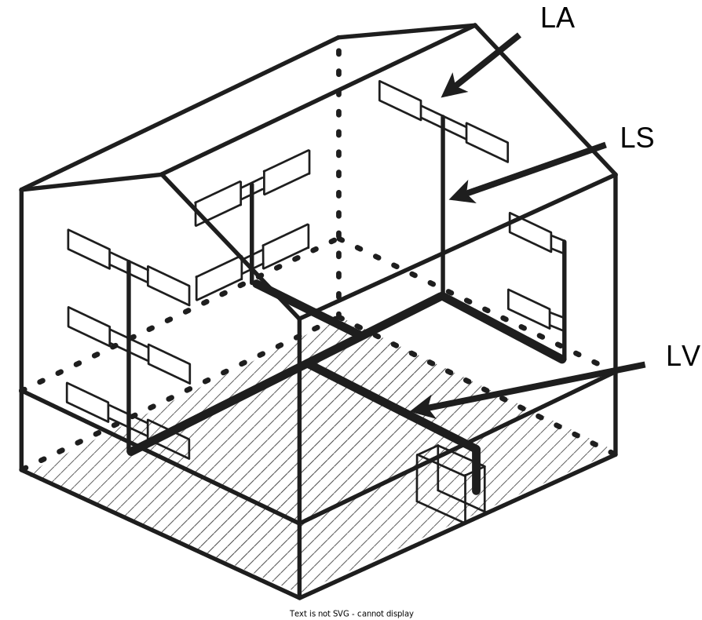

# Неутилізовані тепловтрати

Згідно з наказом мінрегіону № 169 від 11.07.2018[^1], неутилізовані тепловтрати підсистеми розподілення, $Q_{dis,ls,nrvd}$, розраховуються для кожного місяця за формулою:

$$Q_{dis,ls,nrvd}=Q_{dis,ls,nrbl}+(Q_{dis,ls,rbl}-Q_{dis,ls,rvd}),\tag{1}$$

де $Q_{dis,ls,nrbl}$ — неутилізаційні тепловтрати, кВт·год, розраховуються за формулою ==НОМЕР==;  
$Q_{dis,ls,rbl}$ — утилізаційні тепловтрати, кВт·год, розраховуються за формулою ==НОМЕР==;  
$Q_{dis,ls,rvd}$ — утилізовані тепловтрати, кВт·год, розраховуються за формулою ==НОМЕР==.

{: .note }
> Неутилізаційними вважають тепловтрати підсистеми розподілення, що знаходяться в неопалювальних обʼємах. Утилізаційними вважають тепловтрати підсистем розподілення в опалюваних обʼємах.

Тепловтрати підсистем розподілення, кВт·год, розраховують для за формулою:

$$Q_{dis,ls,(rbl/nrbl)}=\sum \Psi_{L,j}(\theta_m-\theta_j)L_jt_{op,an}$$

де $\Psi_{L,j}$  — лінійний коефіцієнт теплопередачі j-го трубопроводу, кВт/(м·К), визначається відповідно до типових значень лінійного коефіцієнта теплопередачі $\Psi$, Вт/(м⋅К), наведених у ==НОМЕР==;  

## Типові значення лінійного коефіцієнта теплопередачі $\Psi$, Вт/(м·К)

|  | Секція $L_V$ | Секція $L_S$ | Секція $L_A$ |
| ---- | ---- | ---- | ---- |
| Ізольовані, відкрито прокладені трубопроводи | 0,2 | 0,3 | 0,4 |
| Неізольовані трубопроводи |  |  |  |
| $A$ ≤ 200 м² | 1,0 | 1,0 | 1,0 |
| 200 м² < $A$ ≤ 500 м² | 2,0 | 2,0 | 2,0 |
| $A$ > 500 м² | 3,0 | 3,0 | 3,0 |
{: .note }
> __\*Примітка 1. __ Для правил визначення $L_V$, $L_S$, $L_A$ (==див малюнок==)
>__\*Примітка 2.__ $A$ — кондиціонована площа будівлі.
>
>В даному розрахунку, для спрощення, приймається що всі трубопроводи типу $L_V$, знаходяться в некондиціонованому обʼємі, а трубопроводи $L_S$ та $L_A$ знаходяться в кондиціонованому обʼємі.

[^1]: [Наказ мінрегіону № 169 від 11.07.2018 "Про затвердження Методики визначення енергетичної ефективності будівель"](https://zakon.rada.gov.ua/laws/show/z0822-18#Text)